> **branchxo** is multiverse tic-tac-toe: a normal 3×3 game with a twist — you can
> scrub back along the move timeline, play a *different* move, and **fork a new
> universe** instead of overwriting history. Both timelines live on side by side,
> and the app tracks win/draw probability (vs perfect play) for each.
> It's for anyone who likes the "what if I'd played there instead?" itch made literal.
>
> **Stack:** Expo (React Native) + TypeScript, Zustand state, react-native-skia charts.
> Part of the **établi** suite. All figures below are real screenshots of the
> v0.1.0 release build on an Android emulator, regenerated by `scripts/capture.sh`.

## Table of contents
1. [Quick start](#quick-start)
2. [The board](#feature-the-board)
3. [The move timeline](#feature-the-move-timeline)
4. [Forking a universe (the multiverse)](#feature-forking-a-universe)
5. [The multiverse tree](#feature-the-multiverse-tree)
6. [Heat view](#feature-heat-view)
7. [Win-probability chart](#feature-win-probability)
8. [Settings & reset](#feature-settings--reset)
9. [Showcase / gallery](#showcase--gallery)
10. [Reproducing these figures](#reproducing-these-figures)
11. [Version](#version)

## Quick start
1. Install the v0.1.0 APK (`branchxo-0.1.0.apk`) and open it. The app cold-starts to a fresh base universe with an empty 3×3 board.

   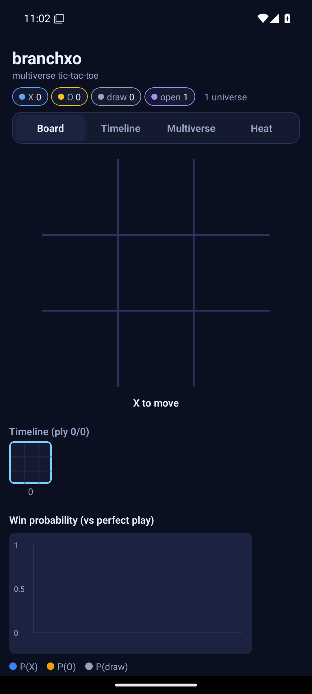

2. The four tabs — **Board · Timeline · Multiverse · Heat** — switch the main view. The status pills (X / O / draw / open / universe count) summarise the whole multiverse at a glance.

## Feature: The board
The board is ordinary tic-tac-toe until you start branching. Tap an empty cell to place the side to move; the footer shows whose turn it is.

1. Tap the centre — X plays.

   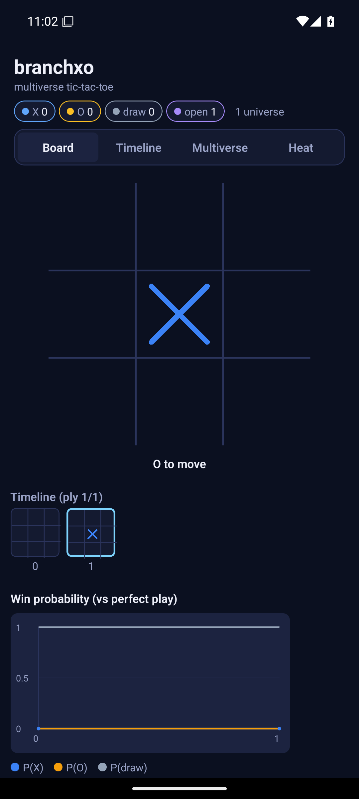

2. O replies in a corner.

   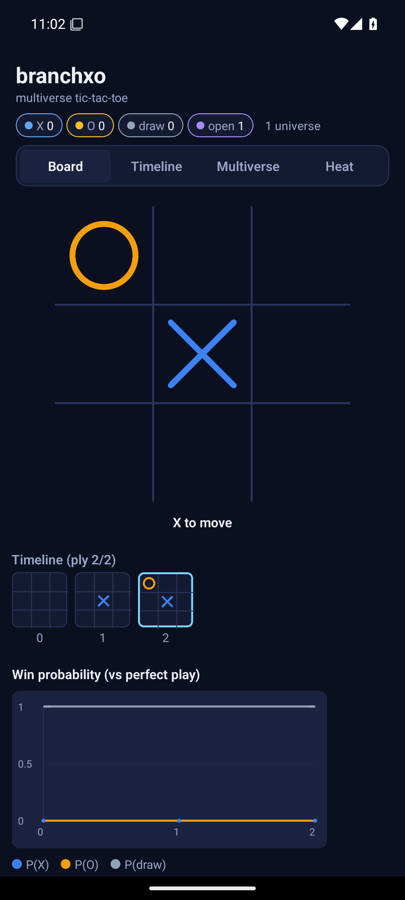

3. A few moves in, the timeline strip and probability chart fill out underneath the board.

   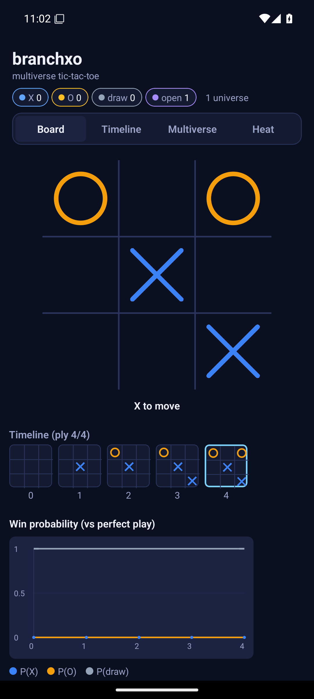

## Feature: The move timeline
Every ply is recorded. The **Timeline** view puts the move history front and centre — each thumbnail is the board at that ply, and the highlighted one is where you currently are.

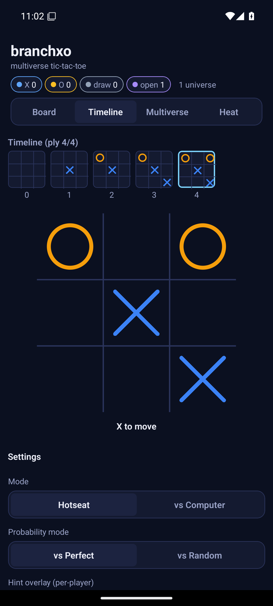

Tapping an earlier ply *scrubs* the game back to that point without deleting anything:

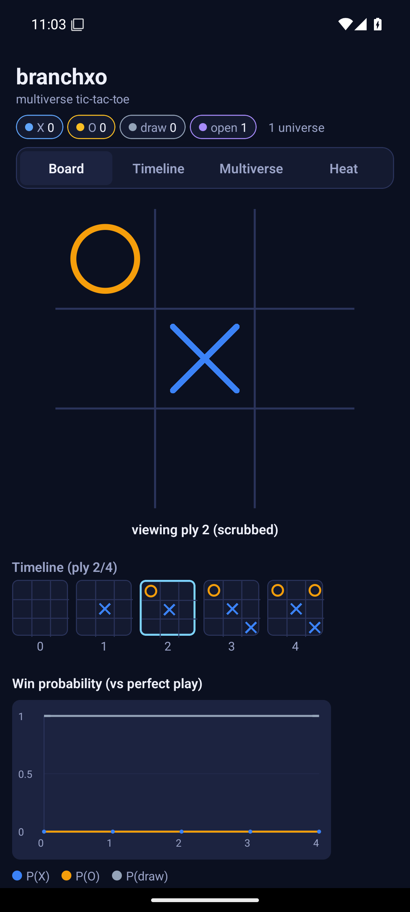

## Feature: Forking a universe
This is the heart of branchxo. After scrubbing back, if you tap a **different** cell than the one originally played, the game asks whether you want to branch — because that move contradicts the recorded future.

1. Scrubbed to ply 2, tap a fresh cell → the fork prompt appears. The original universe is preserved; confirming creates a new one beside it.

   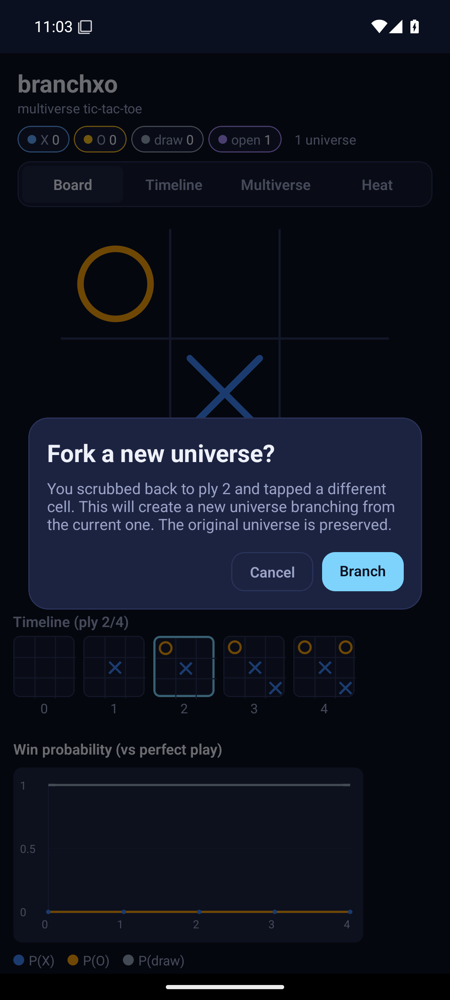

2. Confirm **Branch** — you're now in the new universe, and the header shows the universe count tick up.

   

## Feature: The multiverse tree
The **Multiverse** view draws every universe as a node, connected to the parent it branched from. The active universe is ringed; the summary pills count wins/draws/open across all of them.

1. With a single universe, the tree is one node:

   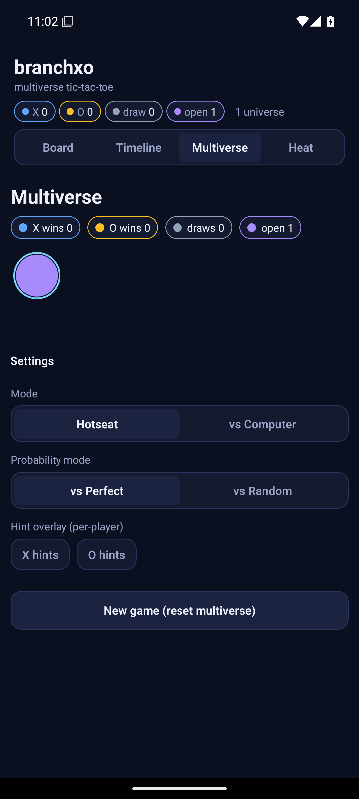

2. After a fork, two universes hang off the timeline — parent and child:

   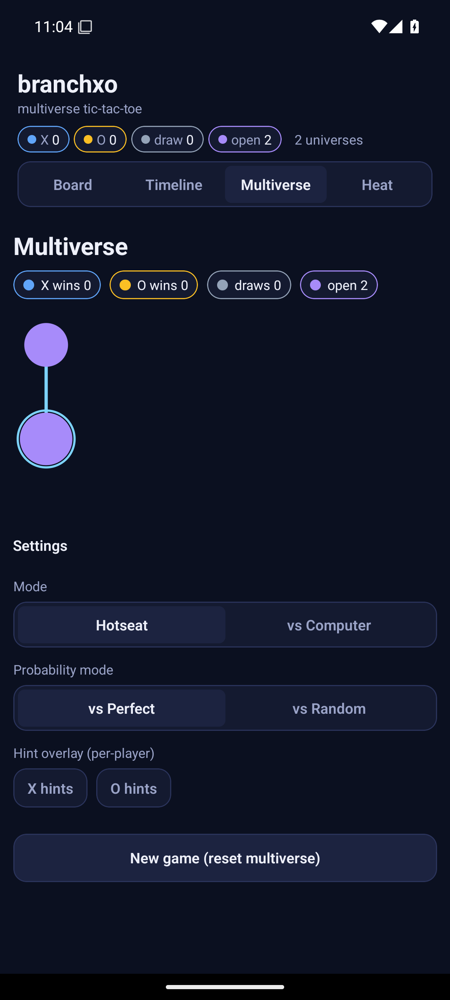

## Feature: Heat view
**Heat** overlays, per cell, how good each move is for the side to move (brighter = stronger), so you can read the board's pressure points at a glance.

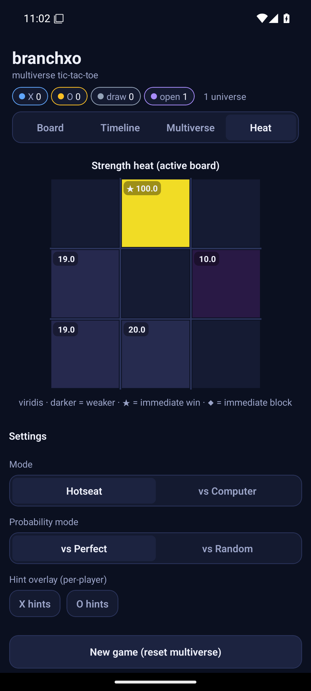

After branching, the heat reflects the active universe's position:

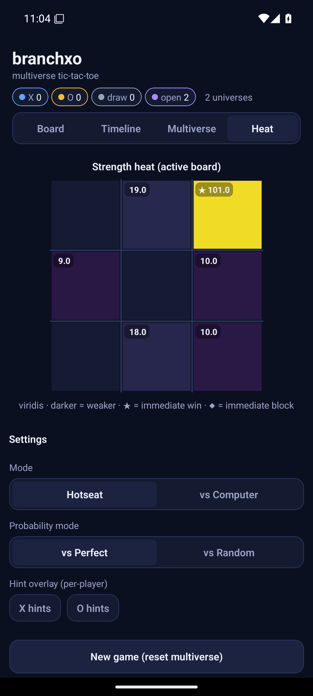

## Feature: Win-probability
Under the board, a **win-probability chart** (react-native-skia) plots P(X) / P(O) / P(draw) across the game versus perfect play, updating every move — visible in the board figures above (e.g. [the mid-game position](assets/0.1.0/04-midgame.png)).

## Feature: Settings & reset
The settings panel sits below every view: **Mode** (Hotseat / vs Computer), **AI level** and **AI plays as** (when vs Computer), **Probability mode** (vs Perfect / vs Random), per-player **hint overlays**, and **New game (reset multiverse)**.

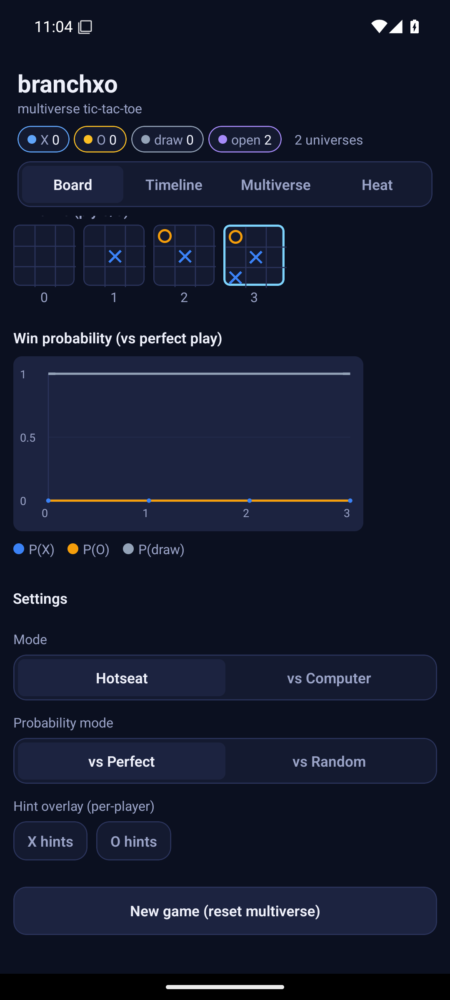

Resetting collapses every branch back to a single fresh universe:

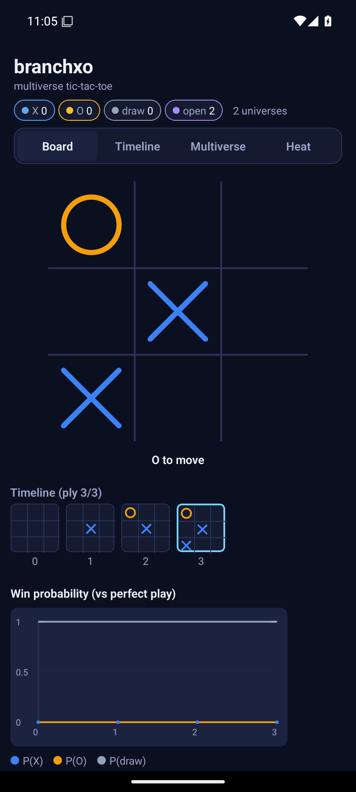

## Showcase / gallery
| | | |
|---|---|---|
|  |  |  |
| home / base | mid-game + chart | timeline |
|  |  |  |
| fork prompt | two universes | heat |

## Reproducing these figures
All figures are generated from the running release build by a committed harness:

```bash
# 1. build + install the release APK on a booted emulator/device
npx expo run:android --variant release
# 2. regenerate every figure into vignettes/assets/0.1.0/
bash scripts/capture.sh
```

Device settings used for deterministic capture: 1080×2400 @ 420dpi, animations
disabled (`window/transition/animator_duration_scale = 0`). Slugs in
`scripts/capture.sh` map 1:1 to the filenames referenced above.

## Version
Documents établi **branchxo v0.1.0** (applicationId `com.raban.branchxo`,
versionCode 1). Part of the établi (workbench) suite.
